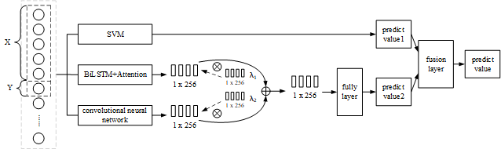

# CombNet
:rocket:实验数据集和代码

## 模型整体架构



## 文件目录树

```
.
├─comp
│  │  MogLSTM.ipynb
│  │  
│  ├─ARIMA
│  │      nanrui.py
│  │      river.py
│  │      
│  └─ARMA
│          nanrui.py
│          river.py
│          
├─data
│      nanrui.csv
│      river.csv
│      
├─draw
│  │  ACF.py
│  │  chart.py
│  │  main_plot_r2.py
│  │  
│  ├─nanrui
│  │      main_plot_ablation_mae_nanrui.py
│  │      main_plot_ablation_r2_nanrui.py
│  │      main_plot_ablation_rmse_nanrui.py
│  │      
│  └─river
│          main_plot_ablation_mae_river.py
│          main_plot_ablation_r2_river.py
│          main_plot_ablation_rmse_river.py
│          
├─imgs
│      1.png
│      2.png
│      3.png
│      4.png
│      5.png
│      6.png
│      7.png
│      model.png
│      nanrui_alpha.png
│      nanrui_auto.png
│      nanrui_graph.png
│      river_alpha.png
│      river_auto.png
│      river_graph.png
│      
├─saved
├─test
│      main_test.py
│      
├─train
│      main_cnn_rnn.py
│      main_svm.py
│      
└─utils
    │  __init__.py
    │  
    └─playStats
            descriptive_stats.py
            hypothesis_testing.py
            interval_est.py
            __init__.py
```

